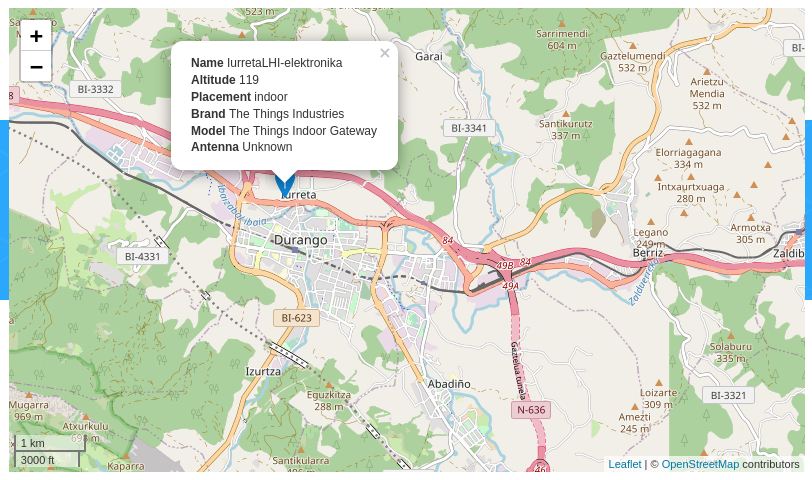
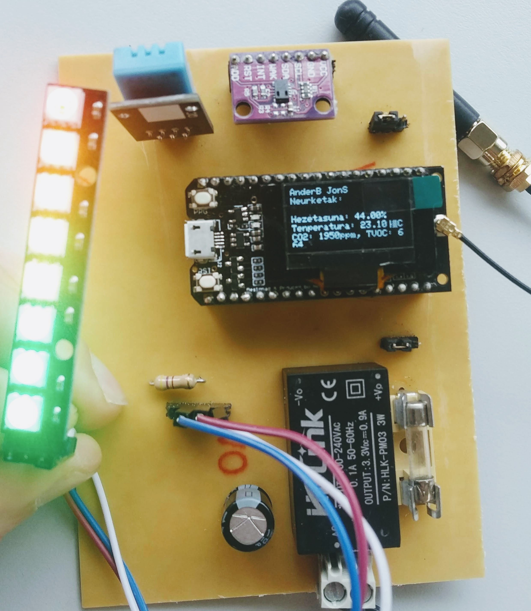
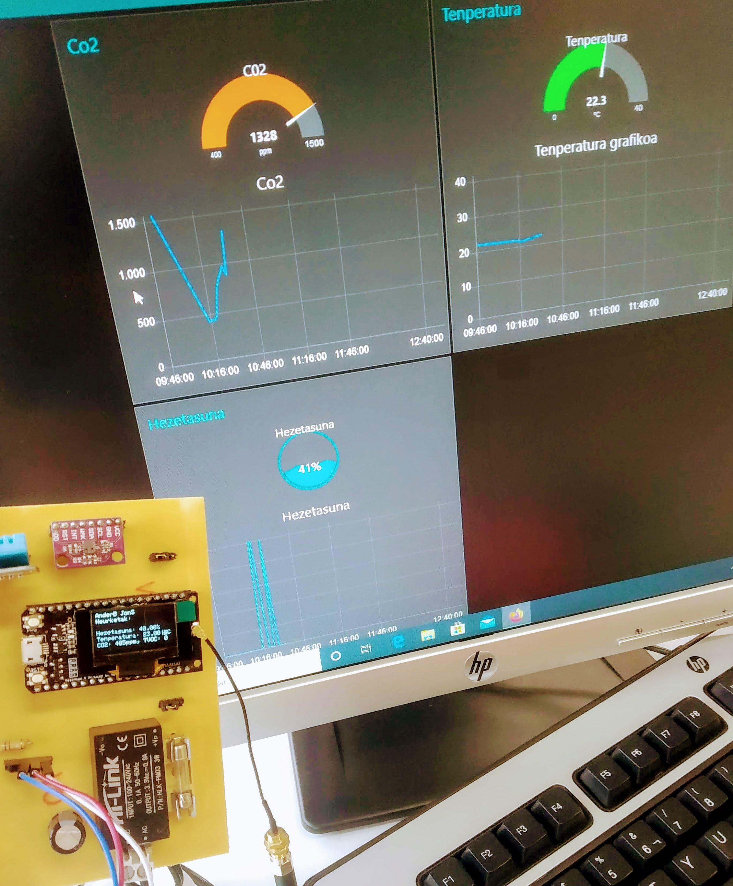

# CO2-OUT
Iurreta LHI ikastetxeko Mantentze-lan elektronikoa heziketa zikloko ikasleek proiektu moduluan egindako lana: CO2, hezetasuna eta tenperatura neurtu eta Lora bitarez TheThingsNetworkera bidali. NodeRed erabiliz datuak erakutsi.

Iurreta Electronic Vocational Training student project: measurement of CO2, humidity and temperature. LORA TTN Communications. Dashvoard via NodeRed.

## The Things Network gateway

## Bloke Diagrama / Block diagram 

## Emaitzak / Result

